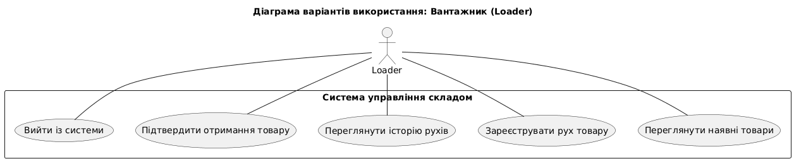

# Inventory Management System

Система для управління інвентарем, локаціями, рухами товарів, постачальниками та правилами поповнення. Проєкт створений для спрощення контролю складу та автоматизації базових операцій.

---

## 🚀 Функціонал

* Додавання та редагування **товарів (item)**
* Управління **залишками на локаціях (inventory)**
* Переміщення інвентарю між локаціями (**movement**)
* Налаштування правил поповнення (**reorder_rule**)
* Робота з постачальниками (**supplier**)
* Управління локаціями (**location**)
* Авторизація користувачів (**user**)

---

## 🛠️ Стек технологій

* **Backend:** Java (Spring Boot)
* **Database:** MySQL
* **Frontend:** HTML / CSS / JavaScript

---

## 📁 Структура проєкту

```
/Inventory
│── project/
│── database/
│    └── warehouse_inventory.sql
│── docs/
│    ├── er-diagram.png
│    └── use-cases.md
│── .gitignore
└── README.md
```

---

## 🧩 ER-діаграми

## Use Case Diagrams


### Administrator


### Loader


### Manager


---

## Class Diagram


## Component Diagram


## Sequence Diagrams

### Admin


### Loader


### Manager


---

## 📦 Встановлення

### 1. Клонування

```
git clone https://github.com/86Undertaker86/Inventory.git
```

### 2. Налаштування середовища

Редагування application.properties:

```
spring.datasource.url=jdbc:mysql://localhost:3306/warehouse_inventory
spring.datasource.username=root
spring.datasource.password=
spring.jpa.hibernate.ddl-auto=update
spring.jpa.show-sql=true
spring.jpa.database-platform=org.hibernate.dialect.MySQL8Dialect

# === JDBC Driver Configuration ===
spring.datasource.driver-class-name=com.mysql.cj.jdbc.Driver
```

### 3. Імпорт бази

* Відкрий **MySQL Workbench / MySQL 8.0 Command Line Client**
* Імпортуй `warehouse_inventory.sql` із папки `/database`

---

## 🖥️ Запуск застосунку

Для запуску Spring Boot застосунку:

```
mvn spring-boot:run
```

---

## 📸 Скриншоти

*(Встав картинки після додавання)*

```


```

---

## 📜 Ліцензія

Проєкт розповсюджується під **MIT License**.

---

## 🙋 Автор

**86Undertaker86** — розробник та автор проєкту.
