# Inventory Management System

A comprehensive system for managing items, inventory balances, locations, stock movements, suppliers, and replenishment rules.  
This project was created to simplify warehouse control and automate essential operations.

---

## ⭐ Key Features

* Create and edit **items**
* Manage **inventory balances across locations**
* Track **stock movements** between locations
* Configure **reorder rules**
* Manage **suppliers**
* Manage **warehouse locations**
* **User authentication** and role-based access

---

## 🛠️ Technology Stack

* **Backend:** Java (Spring Boot)  
* **Database:** MySQL  
* **Frontend:** HTML / CSS / JavaScript  

---

## 📁 Project Structure

```
/Inventory
│── Inventory/
│── database/
│    └── warehouse_inventory.sql
│── docs/
│    ├── er-diagram
│    │    ├── ClassDiagram.png
│    │    ├── ComponentDiagram.png
│    │    ├── SequenceDiagram-Admin.png
│    │    ├── SequenceDiagram-Loader.png
│    │    ├── SequenceDiagram-Manager.png
│    │    └── UseCaseDiagram.png
│    └── screen-page
│         ├── AdminPage.png
│         ├── AdminUsersPage.png
│         ├── LoaderInventoryPage.png
│         ├── LoaderMovementsPage.png
│         ├── LoaderPage.png
│         ├── LoginPage.png
│         ├── ManagerInventoryPage.png
│         ├── ManagerItemsPage.png
│         ├── ManagerLocationsPage.png
│         ├── ManagerMovementsPage.png
│         ├── ManagerReorderPage.png
│         └── ManagerSuppliersPage.png
│── .gitattributes
│── .gitignore
│── LICENSE
└── README.md
```

---

## 🧩 ER-діаграми

## Use Case Diagrams
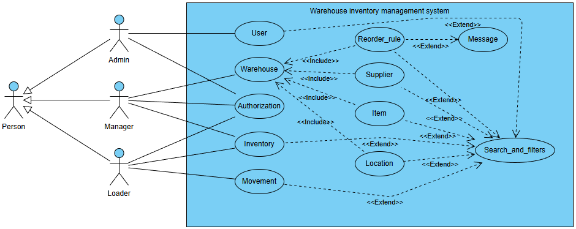

---

## Class Diagram
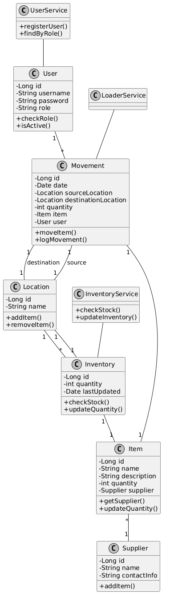

## Component Diagram
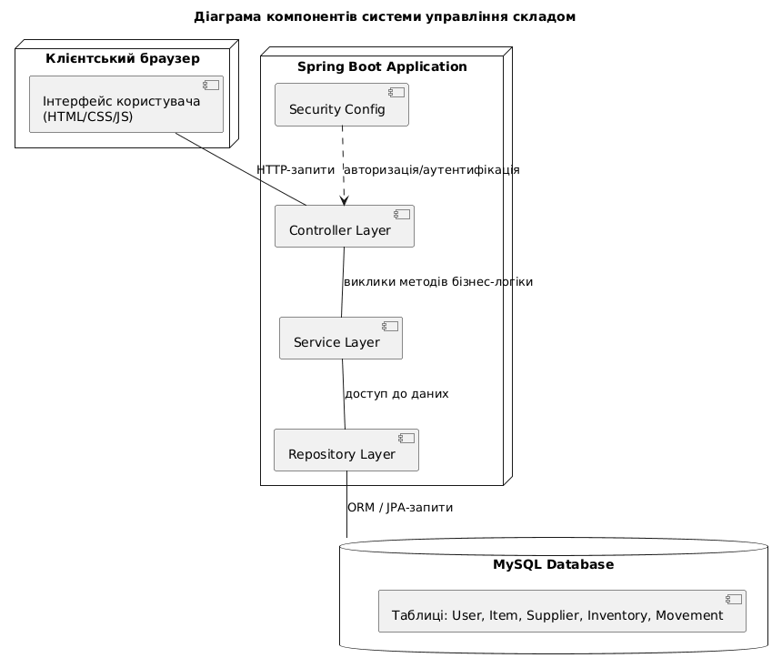

## Sequence Diagrams

### Admin
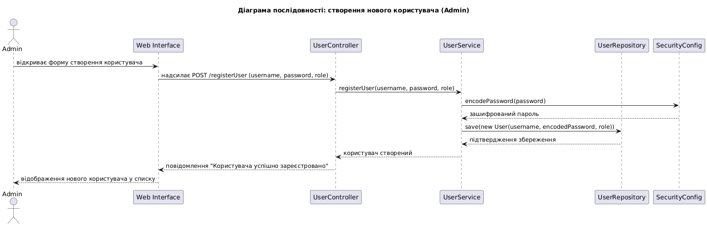

### Loader
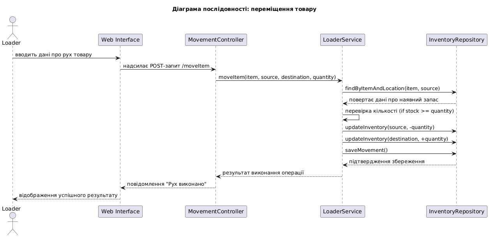

### Manager
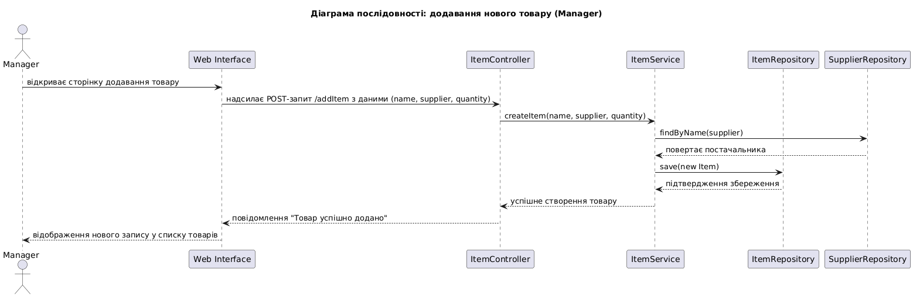

---

## 📦 Installation

### 1. Clone the repository

```
git clone https://github.com/86Undertaker86/Inventory.git
```

### 2. Configure the environment

Edit **application.properties**:

```
spring.datasource.url=jdbc:mysql://localhost:3306/warehouse_inventory
spring.datasource.username=root
spring.datasource.password=
spring.jpa.hibernate.ddl-auto=update
spring.jpa.show-sql=true
spring.jpa.database-platform=org.hibernate.dialect.MySQL8Dialect

# === JDBC Driver Configuration ===
spring.datasource.driver-class-name=com.mysql.cj.jdbc.Driver
```

### 3. Import the database

1. Open **MySQL Workbench** or **MySQL 8.0 Command Line Client**  
2. Import `warehouse_inventory.sql` from the `/database` folder

---

## ▶️ Running the Application

Start the Spring Boot project:

```
mvn spring-boot:run
```

---

## 📸 Скриншоти

## Login Page
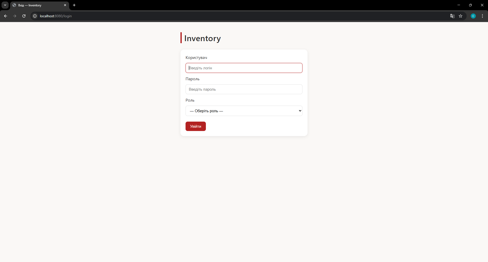

## Admin Page
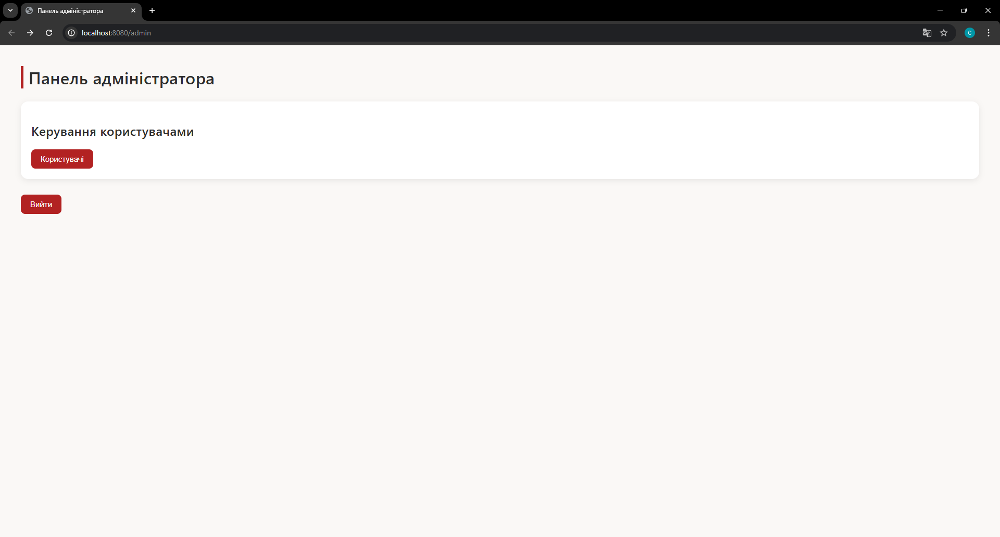

### Admin Users Page
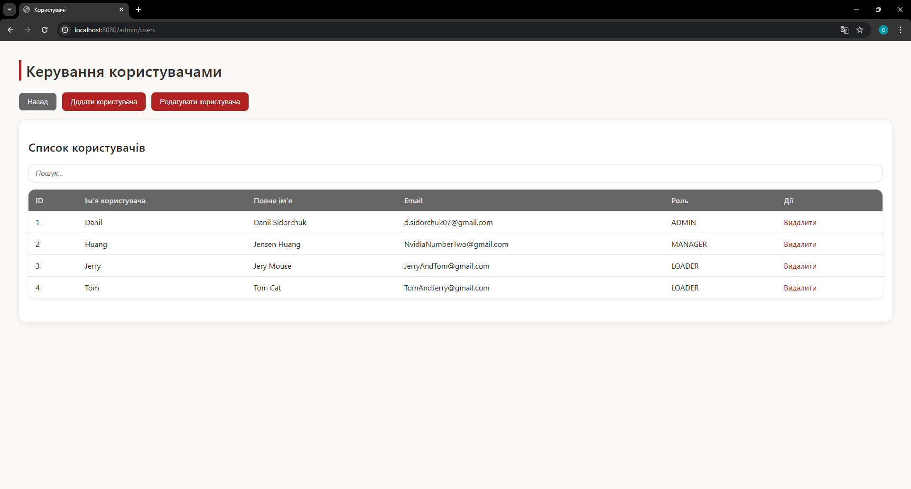

## Manager Page
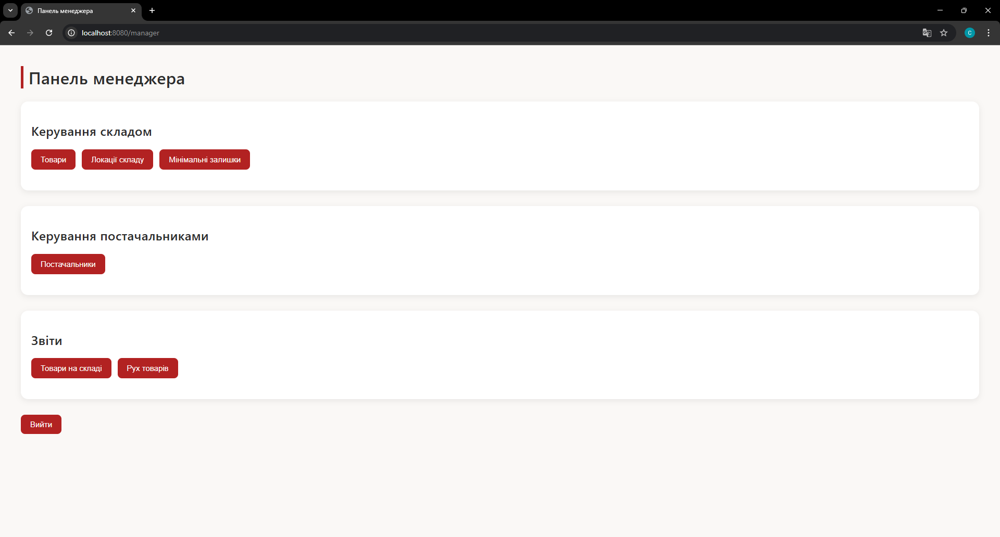

### Manager Items Page
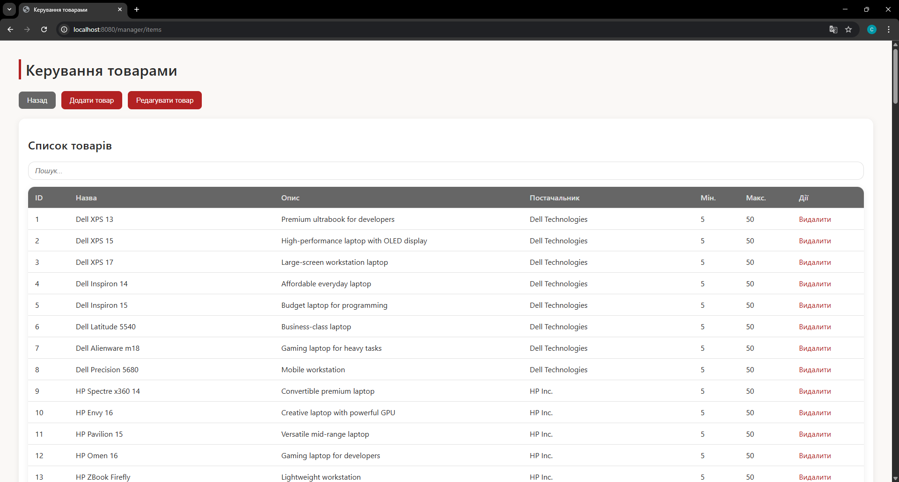

### Manager Locations Page
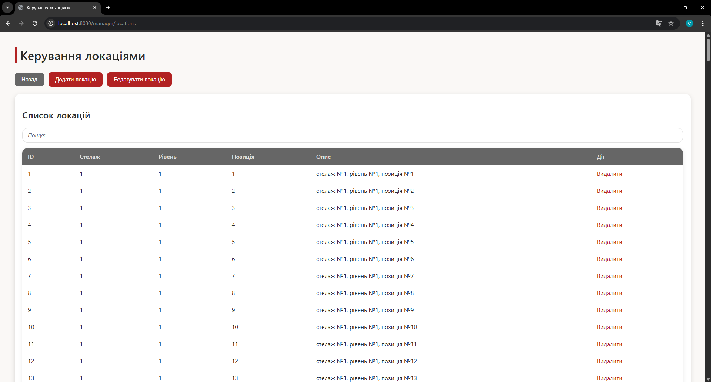

### Manager Reorder Page


### Manager Suppliers Page
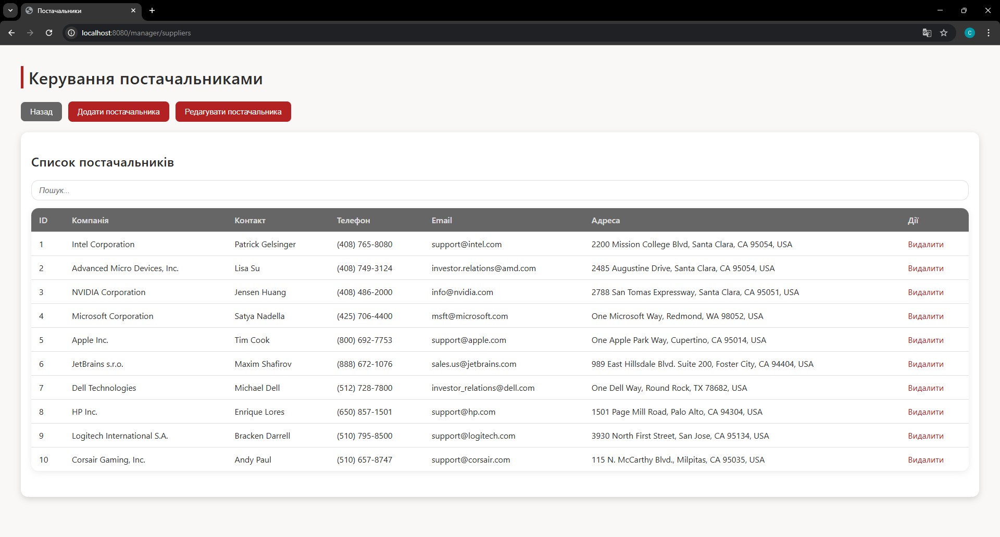

### Manager Inventory Page
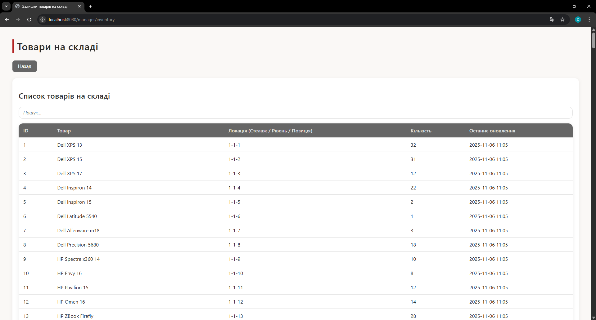

### Manager Movements Page


## Loader Page
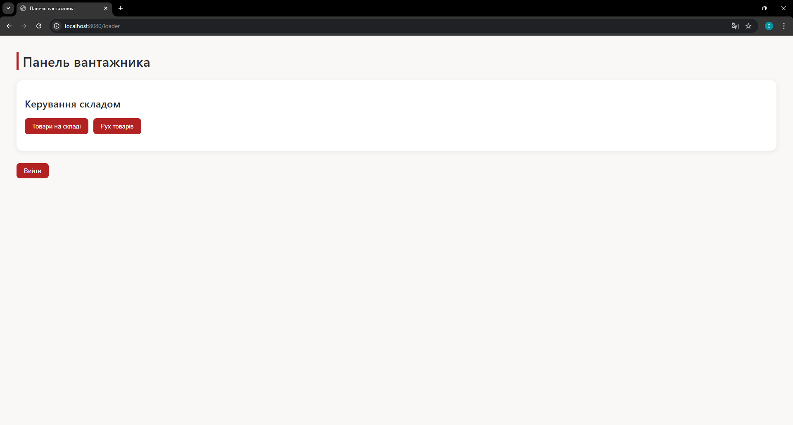

### Loader Inventory Page


### Loader Movements Page
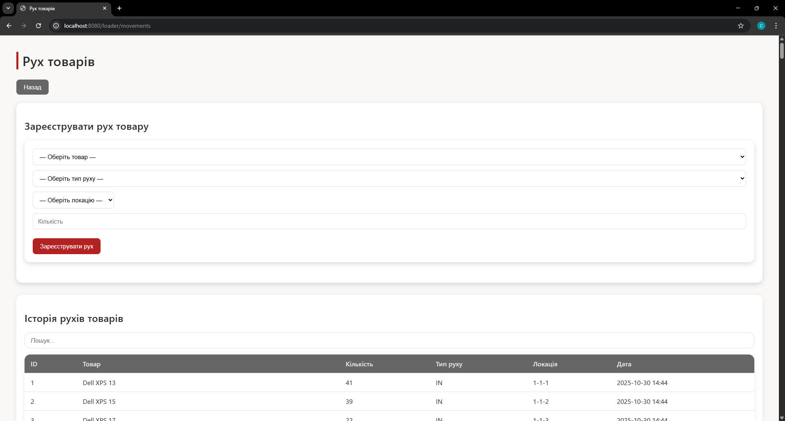

---

## 📜 License

This project is distributed under the **MIT License**.

---

## 👤 Author

**Danil <86Undertaker86> Sidorchuk** — developer and creator of the project.
